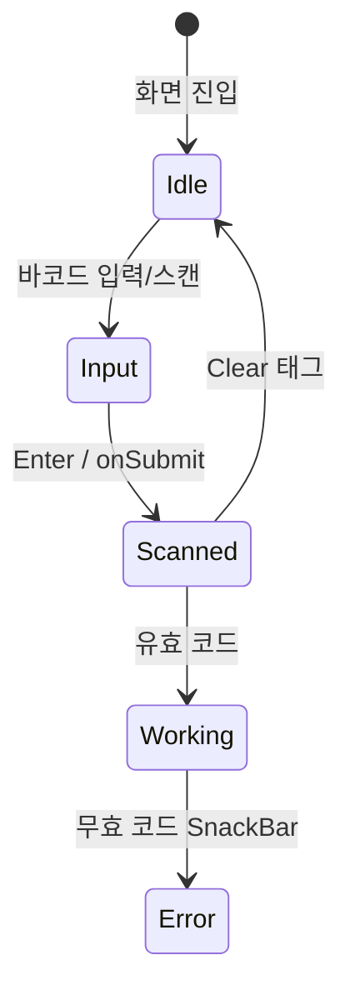
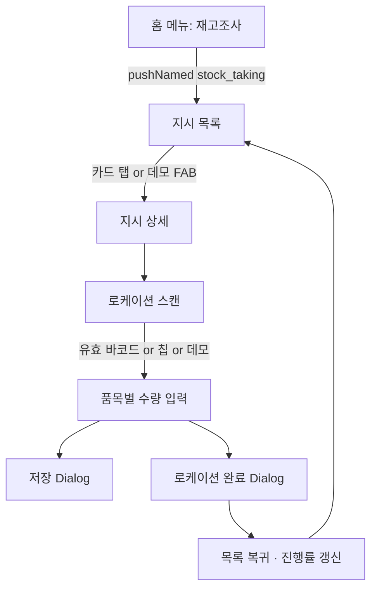

# WMS PDA — UX 설계 정의서

#project #kmarket #wms #pda #ux #flutter

> **대상 코드**: `wms_pda_app`  
> **관련 문서**: [WMS-PDA-UI-Component-Spec.md](WMS-PDA-UI.md), [WMS-PDA-StockTaking-Publishing.md](./WMS-PDA-StockTaking-Publishing.md)

---

## 1. UX 설계 목표 (PDA 특성)

| 원칙          | 설명                                          |
| ----------- | ------------------------------------------- |
| **스캔 우선**   | 키보드 입력보다 바코드 스캔·Enter 제출이 기본 동선             |
| **한 손 조작**  | 하단 액션 바, FAB, 큰 터치 영역 (버튼 높이 52px)          |
| **즉시 피드백**  | 스캔 완료 태그, 좌측 컬러 border, SnackBar, 배지로 상태 전달 |
| **오프라인 가정** | 로컬 SQLite + i18n 번들, 서버 전 연결 UI·더미 흐름 완성    |
| **다국어**     | KO / EN / VI — 화면 문구는 `i18n.t('key')` only  |

---

## 2. 공통 화면 패턴 (Screen Pattern)

### 2.1 Type A — 스캔 → 결과 (단일 화면)

```
[AppBar]
[ScanSection]
[EmptyState | ResultCard]
```

**예**: 상품정보조회 (`product_info`)

### 2.2 Type B — 스캔 → 작업 목록 → 완료 바 (단일 화면·단계 전환)

```
[AppBar]
[ScanSection - 리스트]
[EmptyState]
  ↓ 리스트 로드
[ScanSection - 상품]
[HeaderCard | ProgressCard]
[ItemCard × N]
[CompleteBar]
```

**예**: 상품피킹 (`picking`) — FAB **데모 시작**

### 2.3 Type C — 목록 → 상세 (2화면·Navigator.push)

```
[목록 Screen]
  ProgressCard
  ListHeader
  TappableCard × N
    ↓ onTap
[상세 Screen]
  ItemCard × N
  BottomActionBar (저장 | 완료)
```

**예**: 상품입고검수 (`receiving_inspection`)

### 2.4 Type D — 스캔 → 스캔 → 실행 (듀얼 스캔)

```
[AppBar]
[DualScanSection]
  ScanRow (상품)
  ScanRow (로케이션)
  [실행 버튼]
[ListHeader + ItemCards]
[SummaryBar]
```

**예**: 로케이션이동, 입고적재

### 2.5 Type E — 목록 → 스캔 → 수량 입력 (재고조사) ★

```
[목록 Screen]  ← Type C +
  FAB: 데모 시작

[상세 Screen]
  LocationScanSection
  LocationChips (다로케이션 전환)
  EmptyState | StockCountLineCard × N
  BottomActionBar (저장 | 로케이션 완료)
  FAB: 데모 시작 (로케이션 미선택 시)
```

**예**: 재고조사 (`stock_taking`)

---

## 3. 공통 인터랙션 규칙

### 3.1 바코드 스캔 플로우



| 상태 | UI |
|------|-----|
| Idle | `BarcodeScanField` + hint |
| Scanned | `ScannedBarcodeTag` + subText(부가정보) |
| Error | SnackBar + Empty 유지 |

### 3.2 수량 입력·검증 (재고조사·입고검수)

| 조건 | 좌측 Border | 배지 | 하단 메시지 |
|------|-------------|------|-------------|
| 미입력 | `gray300` | actual/system 표시 | 시스템 수량 안내 |
| 실물 = 시스템 | `successGreen` | 일반 | "일치" (i18n) |
| 실물 ≠ 시스템 | `errorRed` | `errorBackground` | "오류 수량: ±N" |

### 3.3 하단 액션 바

| 버튼 | 스타일 | 활성 조건 |
|------|--------|-----------|
| 보조 (저장) | `OutlinedButton` | 항상 (퍼블리싱: Dialog만) |
| 주 (완료) | `ElevatedButton` / accent | 필수 입력 충족 시 |

재고조사 상세: 전 라인 실물 수량 입력 후 **로케이션 완료** 활성화.

### 3.4 데모(퍼블리싱) UX

API 미연동 단계에서 **FAB `데모 시작`** 으로 전체 화면 흐름 검증.

| 화면 | 동작 |
|------|------|
| 목록 | 첫 지시 + `A-A01-01-01` 로케이션 + 데모 수량 자동 입력 후 상세 진입 |
| 상세 (미스캔) | 미완료 첫 로케이션 + 데모 수량 로드 |
| 상세 | Location Chips로 로케이션 전환 |
| 스캔 힌트 | `예시: A-A01-01-01` (i18n `stock_taking.scan.location.helper`) |

---

## 4. 정보 구조 (IA) — 재고조사

### 4.1 요구 기능 ↔ 화면 매핑

| # | 요구사항 | UX 구현 |
|---|----------|---------|
| 27 | 지시 목록 조회 | `StockTakingListScreen` + InstructionCard |
| 28 | 로케이션 바코드 스캔 | `StockTakingLocationScanSection` |
| 29 | 예상 재고 목록 | `WmsStockCountLineCard` 리스트 |
| 30 | 실물 수량 입력 | `WmsQtyInputBox` (actual) |
| 31 | 시스템 vs 실물 차이 | variance border + helper |
| 32 | 저장·완료 | BottomActionBar + AlertDialog |

### 4.2 화면 흐름도



### 4.3 네비게이션

| 구분 | 방식 |
|------|------|
| 홈 → 목록 | `GoRouter` `pushNamed('stock_taking')` |
| 목록 → 상세 | `Navigator.push(MaterialPageRoute)` |
| 상세 → 목록 | 완료 Dialog 확인 후 `pop` ×2 또는 `pop` ×1 |

---

## 5. 레이아웃·간격 규격

### 5.1 목록 화면 vertical rhythm

```
screenPadding top
  └ WmsProgressCard
  └ gap16
  └ WmsListHeader
  └ gap8
  └ Card × N (margin bottom 12)
screenPadding bottom
AppFooter (목록만)
FAB (데모)
```

### 5.2 상세 화면

```
screenPadding
  └ ScanSection card
  └ gap16
  └ LocationChips (2개 이상 로케이션 시)
  └ gap16 (조건부)
  └ ListHeader + LineCards
bottomActionBar (로케이션 선택 후)
```

---

## 6. i18n UX

| 항목 | 규칙 |
|------|------|
| 키 네이밍 | `{feature}.{area}.{item}` 예: `stock_taking.line.variance` |
| 인자 | `{count}`, `{location}`, `{qty}` |
| 번들 | `assets/i18n/ko.json`, `en.json`, `vi.json` |
| 런타임 | `i18nProvider` — **앱 번들이 서버 DB보다 우선** (신규 키 영문 덮임 방지) |

재고조사 키 prefix: `stock_taking.*` (목록·스캔·라인·Dialog·데모 메시지)

---

## 7. 접근성·PDA 실무 고려

- 숫자 입력: `keyboardType: number`, 중앙 정렬 대형 폰트 (22px)
- 스캔 필드: Enter 시 `onSubmit` — 스캐너 엔터키와 동일
- 완료 버튼 비활성: `gray300` — 미완료 상태 명확화
- 차이 품목 존재 시 상단 **warning** 행 (`stock_taking.message.variance_exists`)

---

## 8. 타 기능과의 UX 일관성

| 요소 | 입고검수 | 재고조사 |
|------|----------|----------|
| 목록 카드 | 좌측 border 상태색 | 동일 |
| 진행 카드 | 인라인 | **WmsProgressCard** (shared) |
| 수량 입력 | 정상/불량 2필드 | 시스템(읽기전용)/실물 2필드 |
| 상세 하단 | 확인 \| 검수완료 | 저장 \| 로케이션완료 |
| 데모 | 없음 | FAB + 칩 + mock helper |

---

## 9. 변경 이력

| 일자 | 내용 |
|------|------|
| 2026-05-20 | 재고조사 Type E 패턴·데모 UX·i18n 우선순위 정리 |
