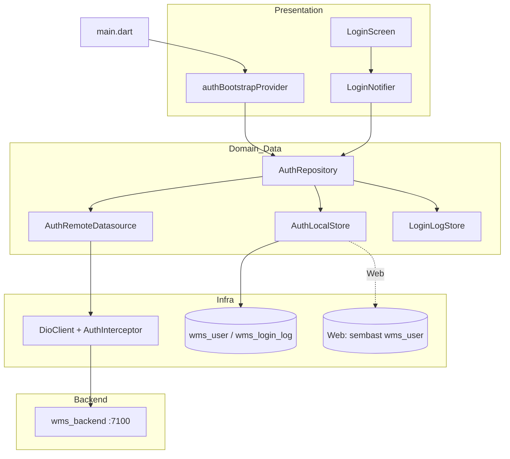
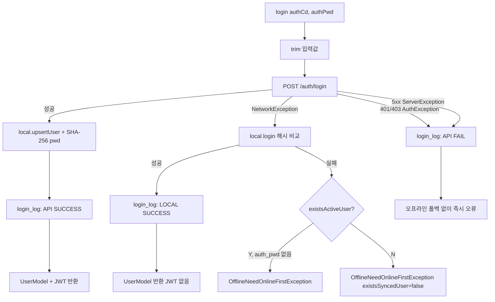
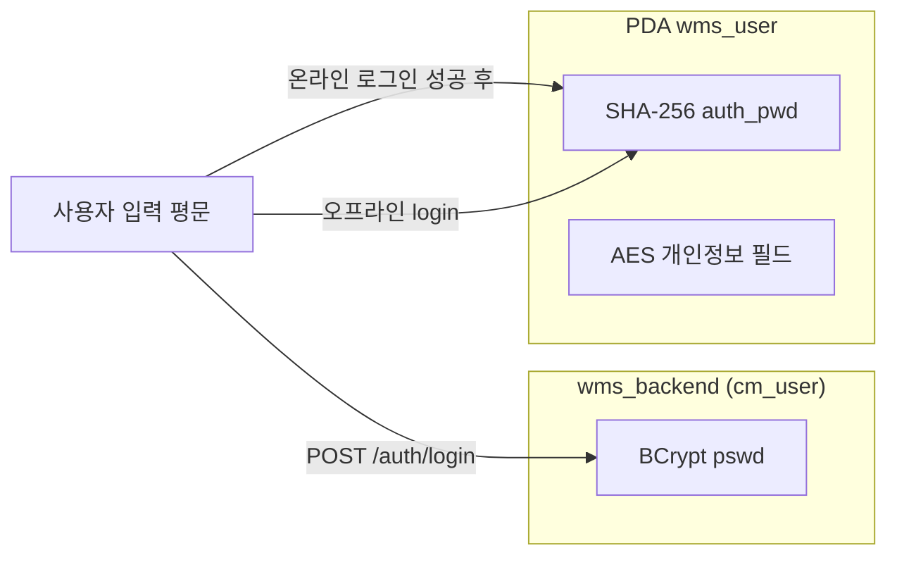

# WMS PDA — 로그인 오프라인 전략 & 사용자 Sync 구조

#project #kmarket #wms #pda #auth #offline #sync

> **기준 코드**  
> - PDA: `wms_pda_app/lib/features/auth/`  
> - 백엔드: `wms_backend` — `AuthController`, `cm_user`  
> **관련 문서**: [WMS-PDA-UI-Component-Spec.md](./WMS-PDA-UI-Component-Spec.md), [K-Market-WMS-Overview.md](./K-Market-WMS-Overview.md)

---

## 1. 설계 목표

| 목표 | 설명 |
|------|------|
| **온라인 우선** | Wi-Fi 가능 시 백엔드(`wms_backend`)가 인증·사용자 마스터의 Source of Truth |
| **오프라인 폴백** | 네트워크 불가 시, **이전에 온라인 로그인에 성공한 계정**만 로컬 DB로 로그인 |
| **기동 시 Sync** | 앱 시작 시 사용자 **목록**(비밀번호 제외)을 받아 로컬 DB 갱신 |
| **보안 분리** | 서버 비밀번호(BCrypt)는 내려받지 않음. 로컬에는 온라인 로그인 성공 시에만 SHA-256 해시 저장 |

---

## 2. 아키텍처 개요



### 2.1 레이어별 역할

| 레이어 | 파일 | 책임 |
|--------|------|------|
| **진입점** | `main.dart` | DB 초기화 → i18n 초기화 → **사용자 Sync** → 앱 실행 |
| **Repository** | `auth_repository.dart` | 온라인/오프라인 로그인 분기, Sync 오케스트레이션 |
| **Remote** | `auth_remote_datasource.dart` | `POST /auth/login`, `GET /auth/users` |
| **Local** | `auth_local_datasource.dart` (모바일) / `web_auth_local_datasource.dart` (Web) | SQLite·Sembast CRUD |
| **로그** | `login_log_datasource.dart` | `wms_login_log` — API/LOCAL 성공·실패 기록 |
| **세션** | `auth_session_provider`, `auth_token_holder` | 로그인 후 JWT·UserModel 보관 |

---

## 3. 백엔드 API (`wms_backend`)

| 메서드 | 경로 | 용도 | 인증 |
|--------|------|------|------|
| `GET` | `/auth/users` | PDA 기동 시 사용자 목록 Sync | `permitAll` (`/auth/**`) |
| `POST` | `/auth/login` | 온라인 로그인 (BCrypt 검증 + JWT 발급) | `permitAll` |

### 3.1 공통 응답 래퍼 — `ResponseDTO`

```json
{
  "success": true,
  "code": null,
  "message": null,
  "data": { }
}
```

PDA는 `ApiResponseParser.unwrapData()` / `unwrapList()`로 `data`만 추출합니다.

### 3.2 `GET /auth/users` — 사용자 Sync

- **DB**: `wms.cm_user` (`use_yn = 'Y'`)
- **DTO**: `UserInfoDTO` (로그인과 동일, **`token`은 null**)

| JSON (camelCase) | PDA `UserModel` | 비고 |
|------------------|-----------------|------|
| `userId` | `empNo`, `authCd` | 로그인 ID |
| `userName` | `empNm` | `emp_nm` |
| `authCode` | `roleId` → `menuLevel` | `role_id`, ADMIN=9 |
| `token` | `accessToken` | 목록 Sync 시 없음 |

### 3.3 `POST /auth/login` — 온라인 로그인

**Request**

```json
{
  "userId": "계정ID",
  "password": "평문비밀번호"
}
```

**Response `data`**: `UserInfoDTO` + JWT (`token`)

- 서버: Spring Security `AuthenticationManager` + `cm_user.pswd` (BCrypt)
- PDA: 평문은 서버로만 전송(HTTPS/개발 HTTP), **로컬에는 SHA-256 해시만 저장**

---

## 4. 앱 기동 시 Sync 구조

### 4.1 실행 순서 (`main.dart`)

```
1. WidgetsFlutterBinding
2. AppDatabase.database (모바일/데스크톱 sqflite)
3. i18nProvider.initialize()     ← /common/lang 등
4. authBootstrapProvider         ← GET /auth/users → local.syncUsers()
5. runApp(WmsPdaApp)
```

### 4.2 `syncUsersOnStartup()` 동작

```dart
// auth_repository.dart
Future<bool> syncUsersOnStartup() async {
  try {
    await syncUsers();  // remote.fetchUsers → local.syncUsers
    return true;
  } on NetworkException {
    return false;       // 기존 로컬 데이터 유지
  } on AppException {
    return false;
  }
}
```

| 결과 | 의미 |
|------|------|
| `true` | 서버 목록으로 로컬 `wms_user` 갱신 완료 |
| `false` | 오프라인·서버 오류 — **마지막 Sync 데이터**로 로그인 시도 가능 |

### 4.3 `syncUsers()` 로컬 반영 규칙

`AuthLocalDatasource.syncUsers()` (Web 구현 동일 정책):

| 케이스 | 처리 |
|--------|------|
| 서버에만 있는 사용자 | **INSERT**, `auth_pwd = ''`, `use_yn = 'Y'` |
| 서버·로컬 모두 존재 | **UPDATE** (이름·권한·센터 등), **`auth_pwd`는 변경하지 않음** |
| 로컬에만 존재 (서버에서 삭제/비활성) | `use_yn = 'N'` (오프라인 로그인 불가) |

> **중요**: Sync만으로는 오프라인 로그인이 **불가능**합니다. `auth_pwd`가 비어 있기 때문입니다.

---

## 5. 로그인 오프라인 전략 (Hybrid)

### 5.1 의사결정 흐름



### 5.2 온라인 vs 오프라인 비교

| 구분 | 온라인 (API) | 오프라인 (LOCAL) |
|------|----------------|------------------|
| **트리거** | API 호출 성공 | `NetworkException`만 |
| **비밀번호 검증** | 서버 BCrypt | 로컬 SHA-256(`auth_pwd`) |
| **JWT** | `AuthTokenHolder`에 저장 | 없음 (이후 API는 토큰 없음) |
| **로그 `login_type_cd`** | `API` | `LOCAL` |
| **선행 조건** | 네트워크 + 유효 계정 | **과거 온라인 로그인 1회 이상** (해시 존재) |

### 5.3 오프라인 폴백 **하지 않는** 경우

`ApiErrorHandler`가 HTTP 응답을 받은 경우 → `NetworkException`이 **아님**:

| 예외 | HTTP | 사용자 메시지 (i18n) |
|------|------|----------------------|
| `AuthException` | 401 | `auth.error.invalid` |
| `AuthException` | 403 | `auth.error.forbidden` |
| `ServerException` | 404, 5xx | `common.error.*` |

→ 비밀번호가 틀렸는데 오프라인으로 우회 로그인되면 안 되므로, **의도적으로 로컬 폴백 없음**.

### 5.4 오프라인 실패 세분화

| 상태 | `existsActiveUser` | `hasOfflineCredentials` | 예외 | UI 메시지 키 |
|------|--------------------|-------------------------|------|----------------|
| Sync된 계정, 온라인 1회 미로그인 | true | false | `OfflineNeedOnlineFirstException` | `auth.error.need_online_first` |
| 로컬에 계정 자체가 없음 | false | false | 동일 | `auth.error.offline_fallback` |

---

## 6. 로컬 DB 스키마

### 6.1 `wms_user`

| 컬럼 | 타입 | Sync | 로그인(온라인) | 로그인(오프라인) |
|------|------|------|----------------|------------------|
| `emp_no` | PK | 서버 `userId` | 동일 | — |
| `emp_nm` | TEXT | 갱신 | 갱신 | — |
| `auth_cd` | TEXT | 갱신 | 갱신 | **조건 키** |
| `auth_pwd` | TEXT | 신규=`''`, 기존 유지 | **SHA-256(평문)** 저장 | **해시 비교** |
| `cntr_cd` | TEXT | 갱신 | 갱신 | — |
| `menu_level` | INT | 갱신 | 갱신 | — |
| `use_yn` | TEXT | Y/N | Y | Y만 |
| `synced_at` | TEXT | ISO8601 | 갱신 | — |
| `emp_addr`~`e_mail` | TEXT | AES 저장 | AES 저장 | — |

### 6.2 `wms_login_log`

| 컬럼 | 예시 |
|------|------|
| `login_type_cd` | `API` / `LOCAL` |
| `result_cd` | `SUCCESS` / `FAIL` |
| `fail_reason` | 실패 시 사유 문자열 |

---

## 7. 비밀번호·암호화 정책



| 위치 | 알고리즘 | 용도 |
|------|----------|------|
| 서버 `cm_user.pswd` | **BCrypt** | 온라인 인증 |
| 로컬 `auth_pwd` | **SHA-256** (`PasswordHasher`) | 오프라인 인증 |
| 로컬 `emp_addr` 등 | **AES-256** (`FieldEncryptor`) | 개인정보 저장 |

> BCrypt 해시를 PDA로 Sync하지 **않음** — 오프라인에서 서버와 동일 검증 불가, 보안상 비밀번호 미전송 원칙.

---

## 8. 네트워크·세션

### 8.1 Base URL (`Env.wmsBaseUrl`)

| 실행 환경 | 기본값 |
|----------|--------|
| Flutter Web | `http://localhost:7100` |
| Android 에뮬레이터 | `http://10.0.2.2:7100` |
| iOS 시뮬레이터 / 데스크톱 | `http://localhost:7100` |
| 실제 기기 | `--dart-define=WMS_BASE_URL=http://<PC_IP>:7100` |

### 8.2 JWT (`AuthTokenHolder` + `AuthInterceptor`)

- 온라인 로그인 성공 시 `UserModel.accessToken` → `AuthTokenHolder.setToken()`
- 이후 `DioClient` 요청에 `Authorization: Bearer {token}` 자동 부착
- 오프라인 로그인 시 JWT 없음 → 인증 필요 API는 실패 가능 (현재 `/auth/**`, `/common/lang` 등은 permitAll)

---

## 9. 플랫폼별 Local 구현

| 플랫폼 | 구현체 | 저장소 |
|--------|--------|--------|
| Android / iOS / Desktop | `AuthLocalDatasource` | SQLite `wms_user` |
| Web (`kIsWeb`) | `WebAuthLocalDatasource` | Sembast `wms_pda_web.db` |

- **공통 인터페이스**: `AuthLocalStore`
- **하드코딩 시드**: 제거됨 — 사용자는 **반드시** `GET /auth/users` Sync로만 유입

---

## 10. Presentation 연동

### 10.1 로그인 UI

```
LoginScreen
  → LoginNotifier.login()
    → AuthRepository.login()
  → 성공 시 authSessionProvider = user
  → AuthTokenHolder.setToken()
  → context.goNamed('home')
```

### 10.2 i18n 오류 키

| 키 | 상황 |
|----|------|
| `auth.error.required` | 빈 입력 |
| `auth.error.invalid` | 401 |
| `auth.error.forbidden` | 403 |
| `auth.error.need_online_first` | Sync됐으나 온라인 최초 로그인 전 |
| `auth.error.offline_fallback` | 로컬에 계정 없음 |
| `common.error.network` | `NetworkException` |

---

## 11. 시나리오별 동작 예시

### 시나리오 A — 정상 (Wi-Fi ON, 최초 실행)

1. 앱 기동 → `GET /auth/users` → 로컬에 사용자 N명 (`auth_pwd=''`)
2. 로그인 → `POST /auth/login` 성공 → `auth_pwd`에 SHA-256 저장 + JWT
3. 홈 진입

### 시나리오 B — 오프라인 (Wi-Fi OFF, 이전에 온라인 로그인함)

1. 앱 기동 → Sync 실패 → **이전 Sync·캐시 유지**
2. 로그인 → API `NetworkException` → 로컬 SHA-256 비교 **성공** → `LOCAL` 로그
3. 홈 진입 (JWT 없음)

### 시나리오 C — 오프라인 (Sync만 됨, 온라인 로그인 한 번도 안 함)

1. 앱 기동 → Sync 성공 (`auth_pwd`仍 빈 문자열)
2. 로그인 → API 실패 → 로컬 `auth_pwd` 불일치
3. `OfflineNeedOnlineFirstException` → **「Wi-Fi 연결 후 온라인으로 한 번 로그인」**

### 시나리오 D — Wi-Fi ON, 비밀번호 오류

1. `POST /auth/login` → 401 `AuthException`
2. 로컬 폴백 **없음** → `auth.error.invalid`

---

## 12. 코드 파일 맵

### PDA (`wms_pda_app`)

```
lib/
├── main.dart
├── app/config/env.dart
├── core/
│   ├── database/app_database.dart          # wms_user, wms_login_log DDL
│   ├── error/app_exception.dart            # Network / Auth / Offline*
│   ├── error/api_error_handler.dart
│   ├── network/
│   │   ├── dio_client.dart
│   │   ├── auth_interceptor.dart
│   │   ├── auth_token_holder.dart
│   │   └── api_response_parser.dart
│   └── security/
│       ├── password_hasher.dart              # SHA-256
│       └── field_encryptor.dart                # AES
└── features/auth/
    ├── data/
    │   ├── model/user_model.dart
    │   ├── repository/auth_repository.dart   # ★ 오케스트레이션
    │   └── datasource/
    │       ├── auth_remote_datasource.dart
    │       ├── auth_local_store.dart         # interface
    │       ├── auth_local_datasource.dart
    │       ├── web_auth_local_datasource.dart
    │       └── login_log_datasource.dart
    └── presentation/provider/
        ├── auth_repository_provider.dart     # authBootstrapProvider
        ├── login_provider.dart
        └── auth_session_provider.dart
```

### Backend (`wms_backend`)

```
auth/
├── controller/AuthController.java    # /login, /users
├── service/AuthService.java
├── dto/UserInfoDTO.java
├── dto/AuthDTO.java
└── mapper/AuthMapper.xml             # cm_user
```

---

## 13. 제약·향후 과제

| 항목 | 현재 | 향후 검토 |
|------|------|-----------|
| 오프라인 최초 로그인 | 온라인 1회 필수 | 정책 유지 권장 |
| Sync 주기 | 앱 기동 1회 | 홈 새로고침·주기 Sync |
| JWT 갱신 | 없음 | Refresh token |
| 로그아웃 | UI 미연동 | `AuthTokenHolder.clear()` + 세션 초기화 |
| `fetchUsers` 인증 | permitAll | PDA 전용 API Key 검토 |

---

## 14. 변경 이력

| 일자 | 내용 |
|------|------|
| 2026-05-20 | 백엔드 연동 (`/auth/login`, `/auth/users`), 하드코딩 시드 제거, Hybrid 로그인·기동 Sync 문서화 |
